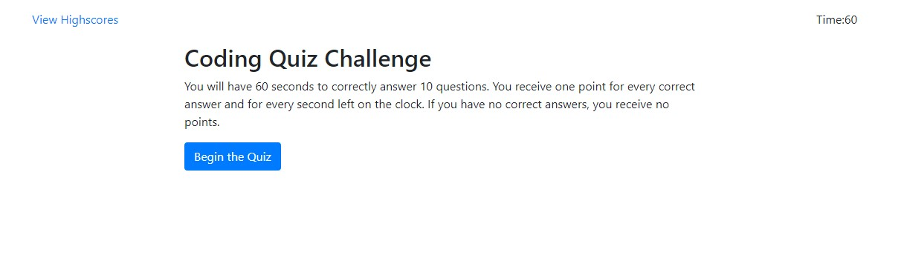
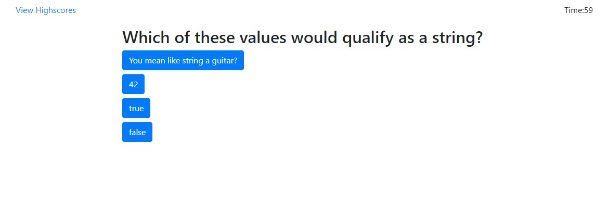
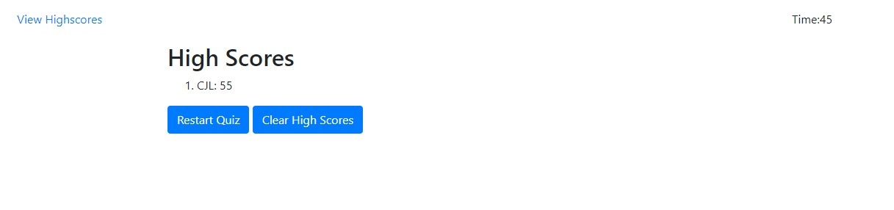

# 04_CodeQuiz
## Homework #4
### About the Project
In this assignment we were tasked with creating a multiple-choice quiz on Javascript content. The quiz needed to be responsive to screen size with HTML and CSS that was updated dynamically with JavaScript code.  

[Link to website](https://cjlaflamme1.github.io/04_CodeQuiz/)

---
### Biggest Challenges
This project introduced a lot of new JavaScript content for me so many aspects were challenging.  Below, I outline some of the larger learnings from my process of development. 

1. Local Storage: The process of storage introduced several problems for me.  At first, when I was just building locally on my machine I found that I kept overriding the content of my local storage, making it impossible to maintain and display high scores.  After much experimentation and research I was able to make it work. But! When I deployed the active link on Github, I found that the process for initiating my local storage did not actively transfer.  In short, it seemed that in each of my functions it was first trying to pull the scores from the storage before it was ever established.  To fix this, I added a new function to check if anything is in storage and if not, to save an empty array into the local storage.  

2. Cycling through Questions: We have done some projects where we had to cycle through an array, but never an array of objects.  It took a lot of experimentation to have a functional question cycle.  

3.  Re-ordering an Array: There was plenty of information available on this process, but I couldn't find any that exactly met my goal.  After much experimentation and console.logs of each aspect of the process, I was finally able to reorder my high scores.  

### Screenshots
**Opening Page**

**Quiz Cards**

**Highscore Page**
